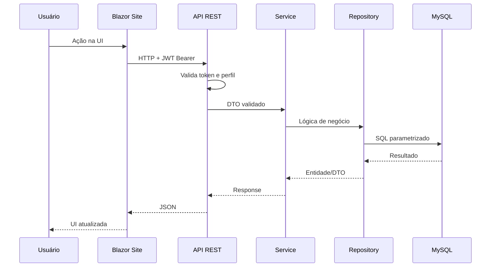

# .NET CRM Fintech Showcase

> Documentação de arquitetura de um **CRM financeiro para consignado** desenvolvido em .NET.  
> Este repositório é um **showcase técnico** — não contém código proprietário nem dados sensíveis.

[](https://dotnet.microsoft.com/)
[](https://dotnet.microsoft.com/apps/aspnet/web-apps/blazor)
[](https://www.mysql.com/)
[](LICENSE)

---

## 📋 Sobre o projeto

Sistema CRM corporativo para operações de **crédito consignado**, cobrindo:

- Gestão de **propostas** com filtros avançados e painel analítico
- **Consulta de margem** automatizada em múltiplos órgãos (INSS, SIAPE, estaduais)
- **Importação/exportação** de arquivos CSV e Excel
- **Autorização por perfil** (Admin, Gestor, Assistente, Vendedor)
- **Workers** para processamento assíncrono e resolução de captcha
- Integração com **AWS S3** para armazenamento de relatórios

---

## 🏗 Arquitetura em camadas

```
┌─────────────────────────────────────────────────────────┐
│  FamCred.CRM.Site          Blazor Server (MudBlazor)    │
├─────────────────────────────────────────────────────────┤
│  FamCred.CRM.API           ASP.NET Core + JWT + Swagger │
├─────────────────────────────────────────────────────────┤
│  FamCred.CRM.Service       Regras de negócio, Jobs,     │
│                            Selenium, NPOI, Integrações  │
├─────────────────────────────────────────────────────────┤
│  FamCred.CRM.Data          EF Core + Dapper + Migrações │
├─────────────────────────────────────────────────────────┤
│  FamCred.CRM.Domain        Entidades, DTOs, Interfaces  │
└─────────────────────────────────────────────────────────┘

┌──────────────────────┐  ┌──────────────────────────────┐
│ FamCred.Job.Worker   │  │ FamCred.Consulta.Margem      │
│ Windows Service      │  │ WinForms + Selenium          │
│ Captcha + Arquivos   │  │ Automação consulta margem    │
└──────────────────────┘  └──────────────────────────────┘
```

### Fluxo de uma requisição (Blazor → API)



---

## 🛠 Stack tecnológica

| Camada | Tecnologias |
|--------|-------------|
| **Frontend** | Blazor Server, MudBlazor, MudExtensions, Radzen |
| **API** | ASP.NET Core 6, Swagger, Identity, JWT Bearer |
| **ORM** | Entity Framework Core (Pomelo MySQL) + Dapper + Dommel |
| **Jobs** | BackgroundService, NCrontab, IServiceScopeFactory |
| **Automação** | Selenium WebDriver (Edge/Chrome), HtmlAgilityPack |
| **Relatórios** | NPOI 2.7, CsvHelper |
| **Cloud** | AWSSDK.S3 |
| **Auth** | ASP.NET Identity, Blazored.SessionStorage |

---

## 🔐 Segurança e LGPD

Práticas implementadas no sistema de produção:

- CPF **mascarado** em logs persistentes (`ILogger`)
- SQL **100% parametrizado** (Dapper/EF) — sem concatenação
- JWT com expiração, validação de issuer/audience
- Autorização no **backend** por perfil — UI não é barreira de segurança
- Connection strings via `IConfiguration` / variáveis de ambiente
- Soft delete para auditoria e conformidade LGPD

---

## 🤖 Automação de margem

Robôs especializados por portal/órgão:

| Tipo | Exemplo de uso |
|------|----------------|
| **HTTP direto** | APIs e endpoints sem navegador |
| **Selenium puro** | Login + captcha + scraping de portais |
| **Híbrido** | Selenium para auth + HTTP para consultas em lote |

Padrões obrigatórios nos jobs:
- `WebDriver` sempre fechado no `finally`
- Credenciais em configuração, nunca hardcoded
- `CancellationToken` propagado em toda a cadeia async
- `IServiceScopeFactory` em serviços singleton

---

## 📊 Funcionalidades de destaque

### Painel analítico de propostas
- Agregações pré-calculadas (materialized summary)
- Background service para refresh periódico
- Exportação Excel otimizada via snapshot

### Processamento de arquivos
- Upload CSV/XLSX com validação de tipo e tamanho
- Worker assíncrono com NPOI
- Armazenamento em S3

### Multi-perfil
| Perfil | Escopo de dados |
|--------|-----------------|
| Admin | Acesso total |
| Gestor | Time sob sua gestão |
| Assistente | Dados do gestor vinculado |
| Vendedor | Apenas próprias propostas |

---

## 📁 Estrutura da solução

```
FamCred.CRM.sln
├── FamCred.CRM.Domain/       # Entidades, DTOs, Interfaces
├── FamCred.CRM.Data/         # Repositórios, Migrations, Mappers
├── FamCred.CRM.Service/      # Serviços, Jobs, Exportação, Selenium
├── FamCred.CRM.API/          # Controllers, JWT, Swagger
├── FamCred.CRM.Site/         # Blazor Server, Pages, Datas
├── FamCred.Job.Worker/       # Windows Service (.NET 8)
└── FamCred.Consulta.Margem/  # WinForms automação (.NET 8)
```

---

## 🧩 Padrões de design

- **Repository Pattern** — `IBaseRepository<T>` + repositórios específicos
- **Service Layer** — regras de negócio isoladas da infra
- **DTO Pattern** — nunca expor entidades na API
- **DI por convenção** — `*Repository` e `*Service` registrados automaticamente
- **BackgroundService** — scope por iteração via `IServiceScopeFactory`

---

## 👤 Autor

**Sóter Fernandes** — [GitHub](https://github.com/soterfernandes) · [LinkedIn](https://br.linkedin.com/in/eusotf)

---

> ⚠️ Este repositório é documentação de portfólio. O código-fonte do sistema em produção é privado.
